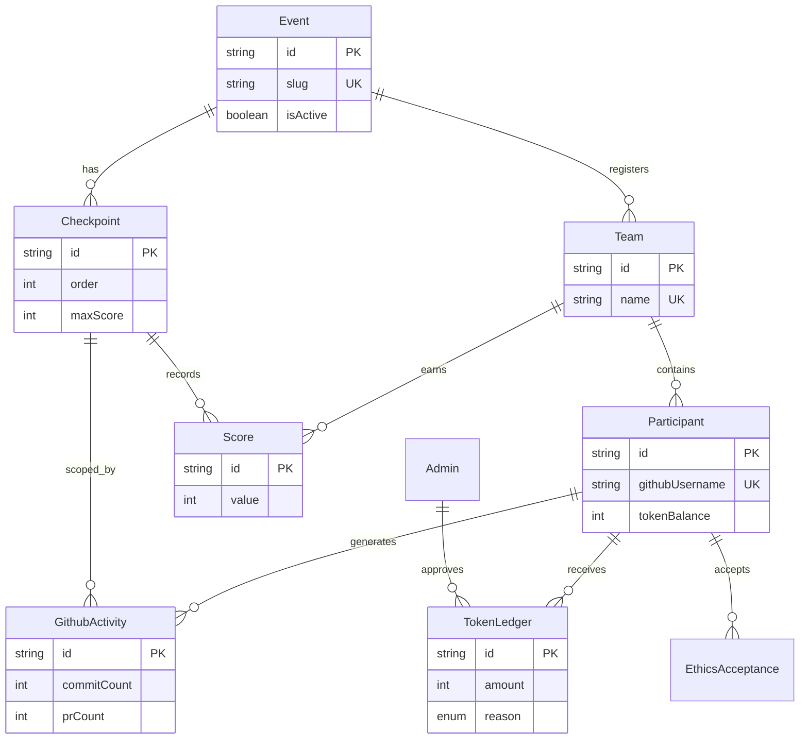

# System Architecture Documentation

This document covers the high-level architecture, database ER Diagram, API routes, and folder structure.

## 1. System Architecture

The application is built on the **Next.js 14 App Router**.
- **Frontend**: React Server Components (RSC) are utilized extensively to directly fetch data from the database, bypassing the need for intermediary API endpoints for page rendering.
- **Backend**: Next.js Route Handlers (`app/api/*`) are used exclusively for mutations (POST/PUT/DELETE) and automated webhooks (Cron).
- **Data Layer**: Prisma ORM provides type-safe database queries. The service layer (`src/services/*`) completely encapsulates database interactions, ensuring Route Handlers and Server Components remain thin.
- **Authentication**: `/login` is the public entry point for both organizer and participant sign-in.

## 2. ER Diagram



## 3. API Documentation

| Route | Method | Access | Purpose |
|---|---|---|---|
| `/api/auth/[...nextauth]` | GET, POST | Public | NextAuth handler for OAuth and Admin Login. |
| `/api/teams` | POST | Admin | Creates a new Team. |
| `/api/teams/[teamId]` | PUT, DELETE | Admin | Updates or Deletes a Team. |
| `/api/scores` | POST | Admin | Upserts a score for a Team at a specific Checkpoint. |
| `/api/cron/github-sync` | GET | Cron | Triggers the background GitHub synchronization script. |

## 4. Folder Structure Documentation

The codebase uses a **Feature-Sliced Design**.

```text
src/
├── app/               # Next.js App Router (Routing structure only)
│   ├── (public)/      # Public-facing routes (Leaderboard, Landing)
│   ├── admin/         # Admin routes (Dashboard, Teams, Scores, Login)
│   └── api/           # API Route Handlers
├── components/        # Reusable UI components
│   ├── ui/            # Radix/shadcn-style primitives
│   ├── layout/        # Navbars, Shells, Footers
│   └── shared/        # Typography, Logos
├── features/          # Domain-specific modules
│   ├── auth/          # Login forms, schemas
│   ├── landing/       # Homepage sections
│   ├── leaderboard/   # Leaderboard tables, logic
│   ├── scores/        # Score entry grids
│   └── teams/         # Team management dialogs
├── lib/               # Infrastructure singletons (Prisma, NextAuth config)
├── services/          # Core Business Logic (DB transactions)
└── utils/             # Pure helper functions (Ranking algo, formatting)
```
